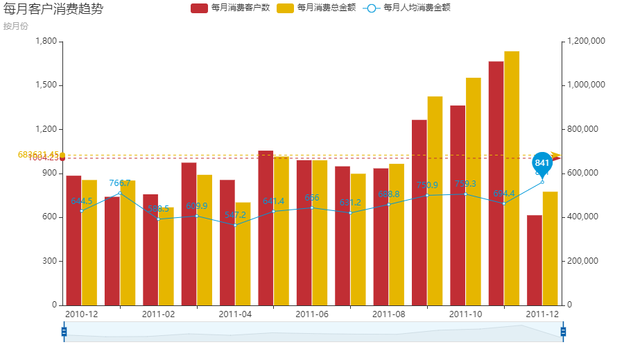
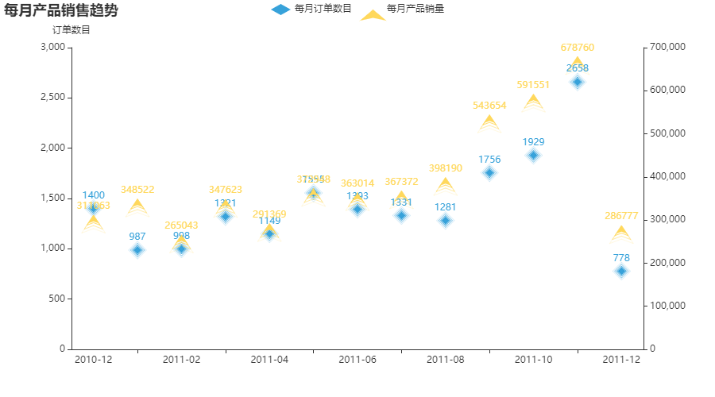
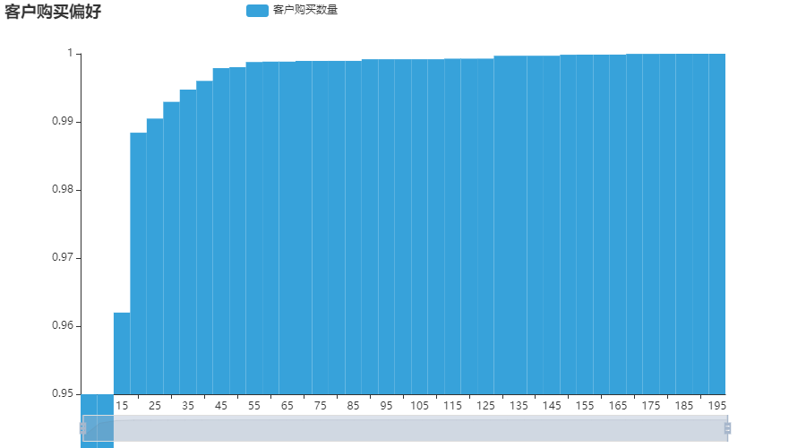
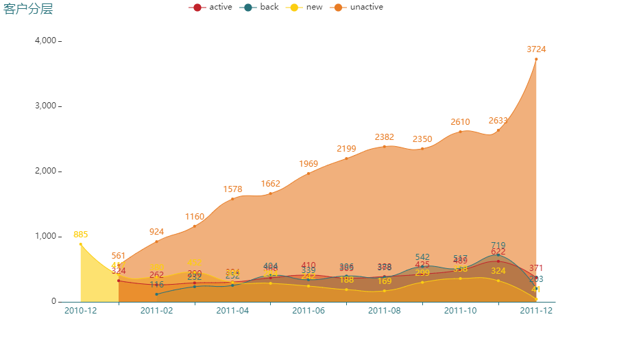
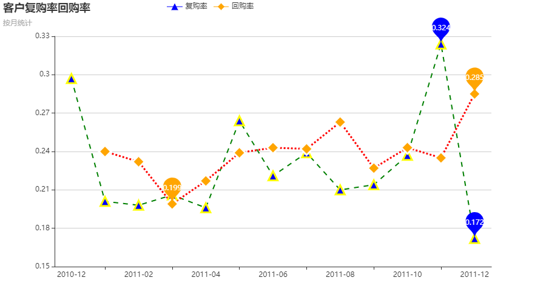
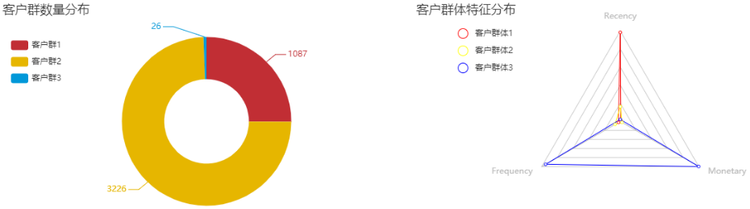

# 电商客户价值分析
## 前言
### RFM简介
* RFM是一种用户客户价值分析的方法，通常用于数据库营销和直接营销，在众多的客户关系管理(CRM)的分析模式中，RFM模型是被广泛提到的。
* RFM模型的三个维度：
    - Recency 最近一次消费
    - Frequency 消费频率
    - Monetary 消费金额
* 基于RFM模型的三个维度，可以将客户分群，衡量客户价值和客户创利能力，对不同的客户群体开展不同的个性化服务，将有限的资源合理地分配给不同价值的客户，实现效益最大化。
### 数据集
> 本次实例所用数据由 Machine Learning Repository 基于一个英国电商公司从2010年12月1号到2011年12月9号的真实的交易数据集进行脱敏处理的。 该电商主要销售的商品是各类礼品。数据下载地址：
https://archive.ics.uci.edu/ml/datasets/Online+Retail
* 数据集大小：(541909,8)
* 数据指标说明
    - InvoiceNo：发票号码，类型数据，每个事务即每笔交易都拥有唯一一个6位整数数字的号码。如果这个号码是以字母C开头，意味着这笔交易是取消的。
    - StockCode：产品（类目）编码，类型数据，每个不同的产品都拥有唯一的一个5位整数数字号码。
    - Description：产品（类目）名称，类型数据。
    - Quantity：在每个发生事务中，即每笔交易中每个产品（类目）的数量，数值数据。
    - InvoiceDate：发票日期和时间，数值数据，每条事务产生的具体日期和时间。
    - UnitPrice：商品单价，数值数据，产品单价/英镑。
    - CustomerID：客户ID，类型数据，每个客户都有唯一一个5位数字的整数号码。
    - Country：国家名称，类型数据，代表每个客户所在的国家或者地区名称。
### 分析目的
> 本实例基于电商分销数据，希望借助`KMeans聚类算法`基于 `RFM模型`对客户进行分群及对细分后的客户群体进行解读，识别出高价值客户，并能够对不同价值的客户群体制定对应的运营策略。


---
## 实例分析
> 只展示可视化结果，省略数据加载、预处理等步骤，详细请参阅`RFM_pracitice.ipynb`

### 描述性分析
#### 月份维度
##### 每月客户消费趋势


* 2011-09至2011-11三个月的消费客户数和消费总金额稳步上涨，达到最高点，但是人均消费金额是2011-12和2011-01这两个月份较高

```
    InvoiceNo	CustomerID	Quantity	InvoiceMonth	Price
540421	581483	16446.0	80995	2011-12	168469.6
61619	541431	12346.0	74215	2011-01	77183.6
52711	540815	15749.0	3114	2011-01	6539.4
52710	540815	15749.0	2000	2011-01	3700.0
52709	540815	15749.0	1930	2011-01	4921.5
```
* 根据上面的结果可以印证，2011-12和2011-01这两个月份在消费人数不高的情况下，人均消费金额却很高，原因是两个"超级"大单的存在，抬高了平均水平

##### 每月订单趋势


* 订单和销量趋势和之前的客户消费趋势基本吻合，订单数和产品销量之间距离越大，则均单销量越高，可以看出2011-01、2011-12的均单销量是前一前二，也是因为之前分析过的超级大单的因素，均单销量位于三四的是2011-08和2011-09

#### 客户维度
##### 客户购买偏好


* 从上图看出，客户对于价格55以上的产品购买欲几乎无差别，无差异扫货；而对于价格50以下的产品购买欲稍稍差一点

##### 客户分层
> 自定义new新客户、active活跃客户、unactive不活跃客户、back回流客户，对客户进行分层
* 一开始客户都属于未消费客户
    - 本月有消费
        - 上月new --> active
        - 上月active --> active
        - 上月unactive --> back
        - 上月未消费 --> new
    - 本月未消费
        - 上月new --> unactive
        - 上月active --> unactive
        - 上月unactive --> unactive
        - 上月未消费 --> 未消费



* 从上图可以看出，该电商客户总体粘性不强，随着时间增长每个月都在流失一定量客户 --> 不活跃客户（除了2011-09），需要制定相关策略激活（挽回）这部分潜在市场
* 每月新增客户数整体呈现下降趋势，说明拓展力度不够，直到211-09至2011-11期间新增客户、回头客户、活跃客户数量有所起色

##### 客户复购率、回购率
>   
    复购率在本实例中如下定义：每个月内订单数超过1个的客户占比
    回购率定义：上一个月未购买客户，本月有购买记录的客户占比



* 客户复购率和回购率基本上都稳定在20%至30%，普遍不高，存在上涨空间，并且二者变化趋势基本一致
* 复购率和回购率都集中在年末2011-11和2011-12达到最大值
---

### 聚类分析
> 聚类指标构建、数据标准化、模型训练等过程省略，聚类K值的选定采取了手肘法，下面展示聚类结果



* 客户群体1 --> 低价值客户 占比近30% - 提高留存、提高活跃度
    - R值很大，F、M值都很低，即低价值客户群体，最近一次购买记录间隔很久远，并且下单次数和消费金额都很低
* 客户群体2 --> 重点发展客户 占比近70% 客户基数大，可发展性强 - 提高活跃度
    - R值相比客户群体1有所降低、F值、M值相比客户群体1有所增加，即重要发展客户
    - 并且客户群体基数巨大，需要针对这部分客户展开相应营销活动，提高客户活跃度、刺激消费欲望
* 客户群体3 --> 高价值客户 占比不到1% - 重点维持，注重客户体验
    - R值很低，F、M值都很高，即高价值客户，重要保持客户，
    - 这部分客户最近一次购买记录离结算日很近，而且消费欲和消费能力都是极高的，这个占比不到整个群体1%的客户群体（26位）贡献了超25%的消费金额，要特别重点照顾这部分客户的购买体验，进一步提高客户忠诚度，持续维系这部分客户
